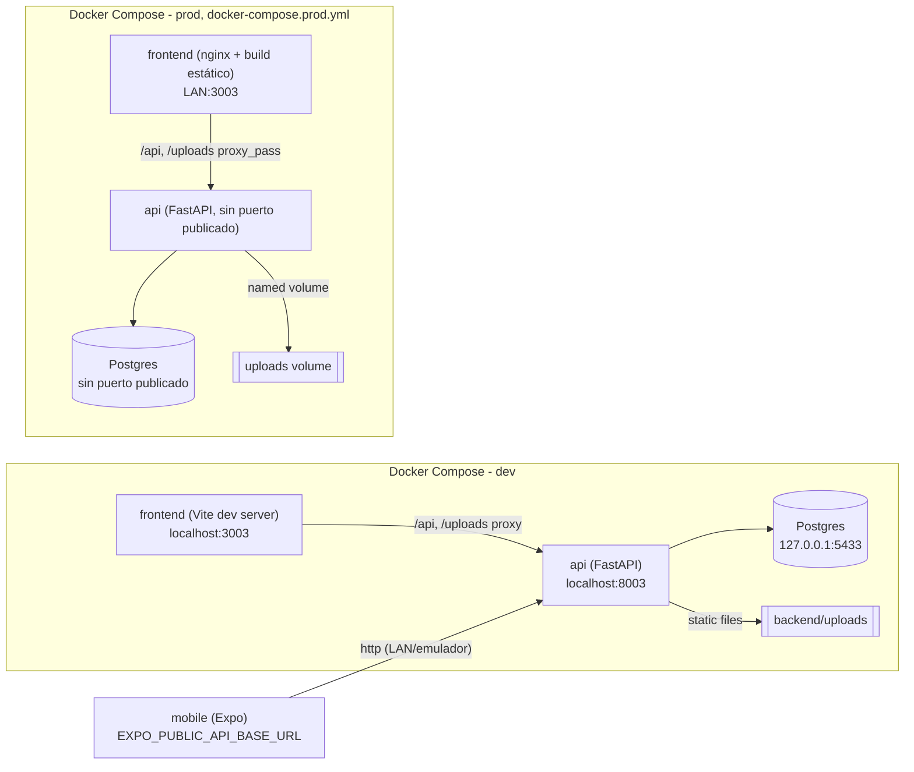

# RankingMJT

Aplicación personal para rankear cosas. Implementa tres rankings propios:
**Monsters** (latas de Monster Energy), **Cervezas** y **Alfajores**. El
producto (`RankingMJT`) no está acoplado a ninguna categoría puntual:
agregar un nuevo ranking no requiere rediseñar la arquitectura de base.

> ⚠️ **Seguridad**: esta versión **no implementa autenticación/login**. La API
> queda abierta dentro del entorno de desarrollo/LAN. **No debe exponerse
> directamente a Internet** sin agregar autenticación/protección adicional
> (reverse proxy con auth, VPN, etc.). Pensada para uso personal en
> local/LAN únicamente.

## Estado actual

- Desarrollo local: Docker Compose, ver [Cómo levantar el entorno dev](#cómo-levantar-el-entorno-dev).
- Deploy: corriendo en un contenedor del homelab personal, solo accesible
  dentro de la LAN doméstica (sin exposición a Internet, sin DNS público, sin
  IP pública). La dirección concreta no se documenta aquí a propósito — ver
  [Producción](#producción) para la forma de desplegarlo vos mismo.
- Sin login/auth.
- Repo público — ver [Seguridad / .gitignore](#seguridad--gitignore).

## Arquitectura



- **backend/**: FastAPI + SQLAlchemy 2 + Alembic + PostgreSQL. Expone `/api/v1`.
- **frontend/**: React + TypeScript + Vite.
  - Dev: dev server en `3003` con proxy interno hacia el backend (mismo
    origen desde el navegador, sin CORS que gestionar).
  - Prod: build estático servido por **nginx** (`frontend/Dockerfile.prod` +
    `frontend/nginx.conf`), que además hace `proxy_pass` de `/api` y
    `/uploads` hacia el servicio `api` — sigue siendo mismo origen desde el
    navegador, cero CORS, cero URL de backend hardcodeada en el JS.
- **mobile/**: Expo + React Native + Expo Router. Consume la misma API vía
  `EXPO_PUBLIC_API_BASE_URL`.
- **docker-compose.yml**: orquesta `db`, `api`, `frontend` para desarrollo
  reproducible (bind mounts, hot reload, puertos de debug expuestos).
- **docker-compose.prod.yml**: override de producción — sin bind mounts, sin
  puertos de `db`/`api` publicados al host, frontend servido por nginx,
  datos persistidos en named volumes. `mobile` corre aparte (Expo dev
  server), no está en compose.

## Stack

| Área      | Tecnologías |
|-----------|-------------|
| Backend   | Python, FastAPI, SQLAlchemy 2 (sync), Alembic, PostgreSQL, Pydantic v2 |
| Frontend  | React 18, TypeScript (strict), Vite |
| Mobile    | Expo (SDK 57), React Native, Expo Router, TypeScript (strict) |
| Infra dev | Docker Compose |

## Puertos de desarrollo

| Servicio        | URL                              |
|-----------------|-----------------------------------|
| Web (frontend)  | http://localhost:3003             |
| API (directa)   | http://localhost:8003/api/v1      |
| API (vía proxy) | http://localhost:3003/api/v1      |
| Uploads         | http://localhost:8003/uploads/... |
| Postgres        | 127.0.0.1:5433 (solo localhost)   |

Se evitaron intencionalmente los puertos `3000`, `3001`, `3002` para no chocar
con otros proyectos locales.

## Cómo levantar el entorno dev

Requisitos: Docker Desktop.

```bash
cd RankingMJT
cp .env.example .env          # ajustar si hace falta, valores de ejemplo ya sirven para dev
docker compose build
docker compose up -d

# Aplicar la migración inicial
docker compose exec api alembic upgrade head

# Cargar el seed (20 Monsters, idempotente)
docker compose exec api python -m app.seed
```

Abrir: **http://localhost:3003**

Para bajar el entorno: `docker compose down` (agregar `-v` solo si se quiere
borrar también los datos de Postgres).

### Backend fuera de Docker (opcional)

El backend está pensado para correr en Docker. Si se quiere ejecutar
localmente hace falta Python 3.12+, instalar `backend/requirements.txt` y una
instancia de Postgres accesible vía `DATABASE_URL`.

## Variables de entorno

Cada módulo tiene su propio `.env.example` con placeholders seguros (nunca
secretos reales):

- `.env.example` (raíz, usado por `docker-compose.yml`): credenciales de
  Postgres para desarrollo, puertos, `DATABASE_URL`, `CORS_ORIGINS`.
- `backend/.env.example`: `DATABASE_URL`, `CORS_ORIGINS`, `UPLOAD_MAX_MB`,
  `UPLOAD_DIR`.
- `frontend/.env.example`: `VITE_PROXY_TARGET` (solo afecta el proxy del
  dev-server, nunca se incluye en el bundle del navegador).
- `mobile/.env.example`: `EXPO_PUBLIC_API_BASE_URL`, con las tres variantes
  documentadas (simulador/web, emulador Android `10.0.2.2`, dispositivo físico
  en LAN con placeholder `192.168.1.100`, **nunca** una IP real).

**Nunca se commitea `.env` real, ni credenciales, ni tokens (Expo/GitHub/SSH),
ni IPs privadas reales.**

## Modelo de datos: Monster

```
id                int, PK
nickname          str        — nombre visual/personal de la lata (ej. "Negra")
flavor            str        — sabor/nombre oficial (ej. "Aussie Lemonade")
rank_position     int        — posición GLOBAL y única en el ranking (1..N)
would_buy_again   bool       — agrupación visual (Compraría / No compraría)
image_path        str | null — ruta relativa dentro de uploads/ (ej. "monsters/<uuid>.jpg")
notes             str | null — aclaraciones libres (ej. "Guarina")
created_at        datetime
updated_at        datetime
```

**No hay puntuación 1–10.** El ranking ES el orden (`rank_position`).
`would_buy_again` solo agrupa visualmente COMPRARÍA / NO COMPRARÍA dentro de
un único ranking global — nunca recalcula la posición.

## Modelo de datos: Beer

```
id                int, PK
brand             str        — marca (ej. "Corona", "Patagonia", "Stella Artois")
name              str        — nombre/variante/producto (ej. "Extra", "Amber Lager")
rank_position     int        — posición GLOBAL y única en SU PROPIO ranking (1..N)
would_buy_again   bool       — agrupación visual (Compraría / No compraría)
image_path        str | null — ruta relativa dentro de uploads/ (ej. "beers/<uuid>.jpg")
thumbnail_path    str | null — ruta relativa del thumbnail (ej. "beers/thumbs/<uuid>.webp")
notes             str | null — aclaraciones libres
created_at        datetime
updated_at        datetime
```

Mismo modelo conceptual que Monster, ranking totalmente independiente (un
`rank_position` propio, sin relación con el de Monsters). Sin seed de datos
ficticios: arranca en 0 cervezas hasta que el usuario cargue las suyas.

## Modelo de datos: Alfajor

```
id                int, PK
brand             str        — marca (ej. "Portezuelo", "Havanna")
name              str        — nombre/producto/variante (ej. "Black", "70% Cacao")
rank_position     int        — posición GLOBAL y única en SU PROPIO ranking (1..N)
would_buy_again   bool       — agrupación visual (Compraría / No compraría)
image_path        str | null — ruta relativa dentro de uploads/ (ej. "alfajores/<uuid>.jpg")
thumbnail_path    str | null — ruta relativa del thumbnail (ej. "alfajores/thumbs/<uuid>.webp")
notes             str | null — aclaraciones libres
created_at        datetime
updated_at        datetime
```

Mismo modelo conceptual que Monster/Beer, ranking totalmente independiente.
Deliberadamente simple: sin relleno, chocolate, país, peso ni puntuación
numérica — eso queda para una iteración futura si hace falta. Sin seed de
datos ficticios: arranca en 0 alfajores hasta que el usuario cargue los
suyos.

## Lógica de ranking

Compartida entre Monster, Beer y Alfajor (`backend/app/ranking.py`, funciones
genéricas `insert_entity` / `move_entity` / `delete_entity` parametrizadas
por modelo SQLAlchemy). Cada entidad tiene su **propio** ranking global de
`1..N` sin huecos ni duplicados, garantizado por una constraint
`UNIQUE(rank_position)` a nivel de base de datos más la lógica de
reordenamiento en el backend (nunca en el frontend).

- **Crear** en posición `P` (rango válido `1..N+1`): las filas con
  `rank_position >= P` se desplazan `+1`, procesadas en **orden descendente**
  (la de mayor posición primero) para no violar el `UNIQUE` en ningún paso
  intermedio.
- **Mover** una fila existente de `old` a `new` (rango válido `1..N`):
  - `new < old`: el rango `[new, old-1]` se desplaza `+1` (orden descendente).
  - `new > old`: el rango `[old+1, new]` se desplaza `-1` (orden ascendente).
  - `new == old`: no-op (el resto de los campos igual se puede actualizar).
  - La fila que se mueve se libera primero a un valor transitorio antes del
    shift, para no chocar contra sí misma bajo el `UNIQUE` no diferido.
- **Borrar** en posición `P`: las filas con `rank_position > P` se desplazan
  `-1`, procesadas en **orden ascendente**.
- Todo dentro de una única transacción DB. Posiciones `<= 0` o fuera de rango
  se rechazan con `422` y un mensaje claro.

Se optó por **updates ordenados** en vez de una constraint `DEFERRABLE`: es
portable (funciona igual en Postgres y en SQLite para los tests) y evita
depender de comportamiento específico de un motor.

## Endpoints (`/api/v1`)

| Método | Path                          | Descripción |
|--------|-------------------------------|-------------|
| GET    | `/health`                     | Chequeo de salud |
| GET    | `/monsters`                   | Lista completa, ordenada por `rank_position` ASC |
| GET    | `/monsters/{id}`               | Detalle |
| POST   | `/monsters`                   | Crear (dispara reordenamiento) |
| PUT    | `/monsters/{id}`               | Editar campos; si cambia `rank_position`, reordena |
| PUT    | `/monsters/{id}/rank`           | Atajo explícito solo para mover de posición |
| DELETE | `/monsters/{id}`               | Eliminar (reordena el resto) |
| POST   | `/monsters/{id}/image`          | Subir foto principal (`multipart/form-data`, campo `file`) |
| GET    | `/beers`                      | Lista completa, ordenada por `rank_position` ASC |
| GET    | `/beers/{id}`                 | Detalle |
| POST   | `/beers`                      | Crear (dispara reordenamiento) |
| PUT    | `/beers/{id}`                 | Editar campos; si cambia `rank_position`, reordena |
| PUT    | `/beers/{id}/rank`            | Atajo explícito solo para mover de posición |
| DELETE | `/beers/{id}`                 | Eliminar (reordena el resto) |
| POST   | `/beers/{id}/image`           | Subir foto principal (`multipart/form-data`, campo `file`) |
| GET    | `/alfajores`                  | Lista completa, ordenada por `rank_position` ASC |
| GET    | `/alfajores/{id}`             | Detalle |
| POST   | `/alfajores`                  | Crear (dispara reordenamiento) |
| PUT    | `/alfajores/{id}`             | Editar campos; si cambia `rank_position`, reordena |
| PUT    | `/alfajores/{id}/rank`        | Atajo explícito solo para mover de posición |
| DELETE | `/alfajores/{id}`             | Eliminar (reordena el resto) |
| POST   | `/alfajores/{id}/image`       | Subir foto principal (`multipart/form-data`, campo `file`) |

Las imágenes se sirven como archivos estáticos en `/uploads/<image_path>`. No
se guardan blobs en Postgres. Se valida tipo de archivo
(`image/jpeg`, `image/png`, `image/webp`) y tamaño máximo (`UPLOAD_MAX_MB`,
5 MB por defecto).

## Seed inicial (20 Monsters)

`docker compose exec api python -m app.seed` — idempotente: si ya existe
alguna fila, no hace nada (no duplica). Carga exactamente las 20 latas
actuales del usuario, en el orden 1..20 dado, agrupadas en COMPRARÍA (1-13) y
NO COMPRARÍA (14-20).

Decisiones sobre datos ambiguos:

- `nickname` = color/apodo visual de la lata; `flavor` = sabor/nombre oficial;
  `notes` = aclaraciones sueltas (solo la #1 tiene nota: `"Guarina"`).
- Nicknames repetidos (`Verde` ×2, `Rosadita` ×2, `Azul` ×2, `Naranja` ×2) son
  intencionales — el mismo color de lata se reutiliza entre sabores distintos.
  `nickname` no es único.
- **No se corrigió ortografía**: se mantuvo la grafía exacta provista, incluso
  con errores evidentes (`Absoletuly Zero`, `White Pineaplle`,
  `Ultra Golden Pineaple`, `Ultra Watermelón`). Editable luego desde la app.

## Migraciones (Alembic)

Migración inicial `0001_monsters` crea la tabla `monsters` con la constraint
`UNIQUE(rank_position)`. `0002_monster_thumbnail_path` agrega
`thumbnail_path` a Monster. `0003_beers` crea la tabla `beers` (mismo patrón:
PK, `UNIQUE(rank_position)` propio, `image_path`/`thumbnail_path` desde el
inicio). `0004_alfajores` crea la tabla `alfajores` (mismo patrón). Ver
detalle de upgrade/downgrade en
[`backend/alembic/README.md`](backend/alembic/README.md).

```bash
docker compose exec api alembic upgrade head
docker compose exec api alembic downgrade -1
docker compose exec api alembic current
```

## Tests

### Backend

```bash
docker compose exec api pytest -q
```

25 tests cubren Monster (casos A–N originales: alta en posición 1,
inserción que desplaza todo hacia abajo, inserción intermedia, inserción al
final, mover arriba/abajo, mover a la misma posición no-op, borrar reordena,
posiciones inválidas rechazadas con 422, no hay duplicados tras secuencias
mixtas de operaciones, `GET` siempre ordenado, actualizar `would_buy_again`
nunca mueve la posición, upload/thumbnail/replace/delete de imágenes, y el
seed de 20 filas es idempotente) + **19 tests cubren Beer**
(`test_beer_ranking.py`, `test_beer_images.py`) + **19 tests cubren
Alfajor** (`test_alfajor_ranking.py`, `test_alfajor_images.py`), mismos
casos adaptados a `brand`/`name`, ejercitando el mismo servicio de ranking
genérico (`app/ranking.py`) y la misma lógica de imágenes/thumbnails.
**Resultado verificado: 63 passed, 0 failed** (incluye los tests de
Monster y Beer sin modificar — regresión confirmada).

### Frontend

```bash
cd frontend
npm install
npx tsc --noEmit   # limpio
npm run lint       # limpio, 0 errores/warnings
npm run build      # build de producción exitoso
```

### Mobile

```bash
cd mobile
npm ci
npx tsc --noEmit    # limpio
npx expo lint       # limpio
npx expo-doctor     # 21/21 checks OK
```

No se genera APK en esta fase. Se agregó `expo-updates` (OTA) y se validó
la configuración (`npx expo config --type public`); no se publicó ningún
update (`eas update`) ni se corrió ningún build EAS.

## Frontend web

Navegación por pestañas (`RankingMJT | Monsters | Cervezas | Alfajores`,
`react-router-dom`) entre `/monsters`, `/beers` y `/alfajores`; `/` redirige
a `/monsters`. Cada ranking: dos secciones (COMPRARÍA / NO COMPRARÍA) con la
posición global bien visible (`#N` grande), imagen, campos propios
(nickname/flavor para Monster, brand/name para Beer y Alfajor), badge y
acciones Editar/Eliminar. Formulario de alta/edición reutilizado, avisa
explícitamente cuando la posición elegida va a desplazar al resto.
Responsive. `ImageLightbox` se reutiliza sin cambios entre los tres
rankings.

## Mobile

Expo SDK 57 + Expo Router + TypeScript estricto. Tres rankings (Monsters en
`/`, Cervezas en `/beers`, Alfajores en `/alfajores`), cada uno con su
propia pantalla listado/crear/editar y el mismo endpoint propio
(`/monsters`, `/beers` o `/alfajores`, sin recalcular posiciones en el
cliente). Un `RankingSwitcher` (segmented control, tabs con `flex: 1` para
repartir el ancho equitativamente) en la cabecera de cada listado permite
saltar entre los tres sin saturar el bottom tab bar — preparado para sumar
un cuarto ranking agregando una entrada más al arreglo de tabs, sin rehacer
el layout. Cada ranking: sección COMPRARÍA / NO COMPRARÍA, `#posición`
grande, imagen, campos propios y badge de estado. Permite ver, crear,
editar (campos propios, posición, `would_buy_again`, notas, foto) y borrar
(con confirmación), con pull-to-refresh y estados de carga/vacío/error.
`ImageViewerModal` se reutiliza sin cambios entre los tres rankings.

- App: `RankingMJT` · slug `rankingmjt` · Android package
  `com.rankingmjt.mobile` · versión `1.1.0` (`versionCode` 5).
- Config de host vía **`EXPO_PUBLIC_API_BASE_URL`** (nunca hardcodeado en el
  código fuente) — ver [`mobile/.env.example`](mobile/.env.example) para las
  variantes de simulador/emulador Android/dispositivo físico en LAN. Las
  imágenes (`/uploads/...`) se resuelven contra el origin derivado de esa
  misma variable (sin duplicar ni hardcodear otra URL).

### Correr mobile en dev

```bash
cd mobile
cp .env.example .env   # ajustar EXPO_PUBLIC_API_BASE_URL según tu entorno
npm install
npx expo start
```

### Generar un APK (EAS Build)

El proyecto está vinculado a EAS (`mobile/eas.json`, sin URLs ni secretos
versionados). El perfil `preview` genera un **APK instalable** (no AAB, no se
publica a ninguna store):

```bash
cd mobile
npx eas-cli whoami                 # confirmar sesión
npx eas-cli build --platform android --profile preview
```

La URL de API que usa ese build **no vive en el repo**: se define como
variable de entorno de EAS (`eas env:set preview --name
EXPO_PUBLIC_API_BASE_URL --value <url> --visibility plaintext`), separada
por entorno (`development` / `preview` / `production`) igual que el resto de
la config sensible/no versionada del proyecto.

**HTTP cleartext en Android**: la API de RankingMJT se consume por `http://`
dentro de la LAN doméstica (sin TLS todavía). Android bloquea tráfico
cleartext por defecto para apps que targetean API 28+. Se habilitó
explícitamente vía `expo-build-properties`
(`android.usesCleartextTraffic: true` en `app.json`, plugin gestionado, sin
tocar código nativo a mano) — resulta en `android:usesCleartextTraffic="true"`
en el manifest final. Cuando el backend migre a HTTPS, esta excepción debería
poder eliminarse.

### Actualizaciones mobile (EAS Update / OTA)

La app usa el mismo concepto de actualización que el resto de las apps
personales del usuario: **una APK base instalada una sola vez**, y después
los cambios de JS/TS/assets se distribuyen por **EAS Update (OTA)** sin
pedirle al usuario que instale una APK nueva.

- Librería: `expo-updates` (config plugin automático, sin entrada manual en
  `plugins` — `runtimeVersion` + `updates.url` en `app.json` son
  suficientes).
- `runtimeVersion`: política `{ "policy": "appVersion" }` — el runtime es el
  valor de `"version"` en `app.json`. Mismo criterio que el resto de los
  proyectos: cualquier cambio que requiera una APK nueva (dependencia
  nativa, SDK de Expo, permisos) debe venir acompañado de un bump de
  `"version"`.
- `updates.url`: `https://u.expo.dev/<projectId>` (el mismo `projectId` ya
  vinculado del proyecto EAS).
- Branch/channel de producción: `production` (`mobile/eas.json`, perfil
  `build.production.channel = "production"`). También se agregaron
  `channel: "preview"` y `channel: "development"` a sus perfiles
  correspondientes, sin romper el perfil `preview` existente.
- Comportamiento (defaults de `expo-updates`, sin código custom): al abrir
  la app, `checkAutomatically: "ON_LOAD"` (default) consulta el update del
  channel asociado al build; si hay uno compatible con el `runtimeVersion`
  actual, lo descarga en segundo plano; la sesión en curso sigue con el JS
  ya cargado; **la próxima vez que se abra la app**, ya corre la versión
  nueva. No hace falta UI de "hay una actualización disponible": el
  comportamiento default ya cumple el objetivo (abrir → chequear/descargar →
  próxima apertura → versión nueva).
- Publicar una OTA (fuera de alcance de esta fase, documentado para cuando
  se decida hacerlo):
  ```bash
  cd mobile
  eas update --branch production --clear-cache
  ```
  El flag `--clear-cache` evita el problema histórico de bundle de Metro
  quedando stale; siempre verificar el bundle resultante antes de
  considerar la publicación terminada.
- **Cuándo hace falta una APK nueva en vez de OTA**: cambios en
  dependencias nativas, upgrade del SDK de Expo, nuevos permisos de
  Android, configuración nativa incompatible, o cualquier cambio que
  requiera modificar `runtimeVersion`. Todo lo demás (JS/TS, estilos,
  assets compatibles, lógica de frontend) va por OTA.
- No se generó ninguna APK ni se publicó ningún `eas update` en esta fase —
  solo se agregó y configuró `expo-updates`, validado con `npx expo config
  --type public` (ver sección de Tests).

## Producción

Deploy en un contenedor Docker/LXC del homelab personal, solo dentro de la
LAN doméstica. Usa el mismo repo, con un override de compose:

```bash
# En el servidor, dentro de la carpeta del proyecto (ej. /srv/apps/RankingMJT)
git clone https://github.com/joacocap11/RankingMJT.git
cd RankingMJT
git checkout main   # o el tag deseado, ej. v1.0.0

# Crear el .env REAL solo en el servidor (nunca commitear este archivo)
cp .env.example .env
# Editar .env con credenciales de Postgres generadas de forma segura
# (POSTGRES_PASSWORD real, no el placeholder de .env.example)

docker compose -f docker-compose.yml -f docker-compose.prod.yml build
docker compose -f docker-compose.yml -f docker-compose.prod.yml up -d

docker compose exec api alembic upgrade head
docker compose exec api python -m app.seed
```

Diferencias clave respecto a dev (ver [`docker-compose.prod.yml`](docker-compose.prod.yml)):

- `db` y `api` **no publican puertos al host** (solo alcanzables en la red
  interna de Docker) — ni Postgres ni la API quedan expuestos por fuera del
  frontend.
- `frontend` se sirve como build estático de nginx
  ([`frontend/Dockerfile.prod`](frontend/Dockerfile.prod) +
  [`frontend/nginx.conf`](frontend/nginx.conf)), que hace `proxy_pass` de
  `/api/` y `/uploads/` hacia `api:8000`. El navegador solo habla con un único
  origen (el propio frontend); no hay CORS que configurar.
- Persistencia en **named volumes** (`rankingmjt_postgres_data`,
  `rankingmjt_uploads`): reconstruir o recrear `api`/`frontend` (`--build`,
  `up -d`) nunca borra la base ni las imágenes subidas.
- El `.env` real con las credenciales de producción vive **únicamente en el
  servidor** y nunca se commitea.

La URL de producción es una IP/hostname interno de la LAN del usuario — se
omite intencionalmente de este README público; queda documentada solo en el
entorno local del propietario.

## Backups

Estrategia simple, sin sistema de backup complejo:

```bash
# Dump de Postgres (custom format, restaurable con pg_restore)
set -a; . ./.env; set +a
./scripts/backup_postgres.sh          # escribe en ./backups/<db>_<timestamp>.dump

# Copia de las imágenes subidas (named volume)
./scripts/backup_uploads.sh rankingmjt_uploads   # escribe en ./backups/<volume>_<timestamp>.tar.gz
```

Restaurar Postgres desde un dump:

```bash
docker compose exec -T db pg_restore --clean --if-exists \
  -U "$POSTGRES_USER" -d "$POSTGRES_DB" < backups/<archivo>.dump
```

`./backups/` está excluido de git (`.gitignore`) — contiene datos reales, no
se versiona. Si el homelab ya tiene una estrategia general de backups (cron +
retención), agregar estos dos comandos ahí siguiendo el mismo patrón que el
resto de las apps del servidor.

## Screenshots

_(Placeholder — agregar capturas de la web y mobile aquí)._

- `docs/screenshots/web-ranking.png` — vista principal "Ranking Monsters".
- `docs/screenshots/web-form.png` — alta/edición de un Monster.
- `docs/screenshots/mobile-ranking.png` — pantalla principal mobile.

## Seguridad / .gitignore

Repositorio pensado para ser **público**. El `.gitignore` de la raíz excluye
explícitamente: `.env` y variantes (excepto `*.env.example`), claves/secretos
(`*.pem`, `*.key`, patrones `*secret*`/`*credential*`, llaves SSH),
`node_modules/`, `dist/`, `.expo/`, cachés de Python/Node, `backend/uploads/*`
(contenido subido en dev), bases de datos locales y archivos de sistema/IDE.

Antes de cada commit se recomienda repetir una búsqueda explícita de
secretos/patrones sensibles.

## Roadmap

- [ ] Autenticación (cuando la app deje de ser solo local/LAN).
- [x] Nueva sección: **Alfajores**.
- [x] Nueva sección: **Cervezas**.
- [ ] Generalizar el concepto de "ranking" a más categorías si hace falta.
- [x] Navegación por categorías (Monsters / Cervezas / Alfajores) en vez de una sola pantalla fija — preparada para sumar un cuarto ranking sin rediseño.
- [x] Deploy en homelab (Proxmox/CT) para uso propio en LAN.
- [ ] Reverse proxy (nginx) — implementado en producción para servir el frontend y proxyear `/api/v1` y `/uploads` al backend; pendiente evaluar TLS/otra capa de protección antes de exponer fuera de la LAN.
- [x] Mobile: build APK (EAS, perfil `preview`) y publicación en el portal interno "Mis Apps" (LAN).
- [x] Mobile: EAS Update/OTA configurado (`expo-updates`, `runtimeVersion` por `appVersion`, channel/branch `production`); publicación OTA real y Play Store quedan fuera de alcance de esta fase.
